<!-- ===== HEADER ===== -->
<h1 align="center">
  
</h1>

<!-- Animated wave divider -->

  <b>Software Engineer</b> — production experience across web &amp; mobile 
  Building the messaging channels &amp; React.js interface for a multi-tenant AI assistant platform 
  WhatsApp · Telegram · Web Chat · RAG pipelines · Android

  
  
  

<!-- ===== SKILL LOADOUT ===== -->
<h2>
  <picture></picture>
  &nbsp;Skill Loadout
</h2>

<!-- ===== STATS ===== -->
<h2>
  <picture></picture>
  &nbsp;Player Stats
</h2>

 

<!-- ===== TECH STACK ===== -->
<h2>
  <picture></picture>
  &nbsp;Tech Stack
</h2>

<b>Languages</b> 

 <b>Frontend &amp; Mobile</b> 

 <b>Backend &amp; Data</b> 

 <b>AI &amp; Integrations</b> 

 <b>Tools</b> 

<!-- ===== SNAKE ===== -->
<h2>
  <picture></picture>
  &nbsp;Contribution Snake
</h2>

  

<!-- Animated footer wave -->

<i>Thanks for visiting — let's build something.</i>

